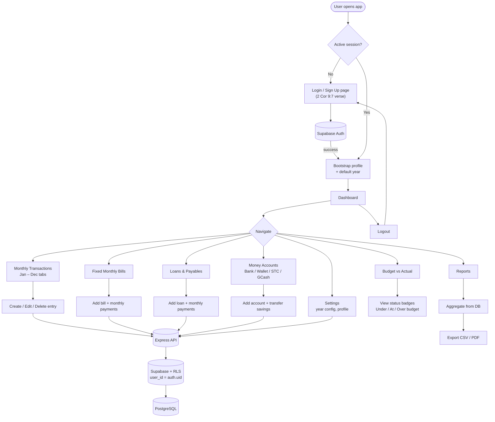
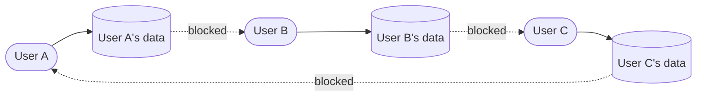

# LGGM — Lamb of God Global Ministries

## Implementation Plan

A responsive web application for **Lamb of God Global Ministries** to monitor and report on church financials — including expenses, income, tithes, seed/offering, money accounts (savings), loan payments, payables, and fixed monthly bills — secured with Supabase Authentication.

> *"Each one must give as he has decided in his heart, not reluctantly or under compulsion, for God loves a cheerful giver."* — **2 Corinthians 9:7**

---

## 1. Project Overview

### Goals
- Centralize the church's financial tracking (currently in Google Sheets — see `LGGM - Ledger of Harvest 2026`).
- Replace manual spreadsheet workflows with a structured, auditable web app.
- Each authenticated user has **full access to their own data only** — single-role, per-user data isolation.
- Generate clear monthly and yearly reports with budget vs. actual comparisons.

### Core Modules
| Module | Source Sheet | Description |
| --- | --- | --- |
| **Dashboard** | `2026` | Yearly overview with **Planned vs. Actual** side-by-side for every distribution (tithes, offering, money accounts, first fruit), monthly status, surplus, year filter |
| **Monthly Transactions** | `Jan`–`Dec` | Daily income/expense entries with category, status, notes; year + month filters |
| **Budget vs. Actual** | `Actual` | Compares planned vs. actual figures month by month, status badge (`Under / At / Over budget`) |
| **Obligations** | `Fixed Monthly Bills`, `List of Loans`, `2026` | Unified, **collapsible** sidebar group containing: Tithes · Offering · First Fruit · **Money Accounts** · Fixed Bills · Loans · Other Obligations. Each tracks planned (from %) vs actual per month. |
| **Reports** | — | Monthly, yearly, category breakdowns; year filter; exportable to CSV/PDF |
| **Settings** | — | Profile, theme, **per-year + per-month** distribution percentage overrides, active year |
| **Auth** | — | Sign up, login, password reset; each user owns and manages their own financial data |

### Key concepts
- **Planned vs. Actual.** For every distribution (tithes, offering, savings/money accounts, first fruit) and every fixed obligation (bills, loans, other), the app stores both the *planned* amount (derived from the income × percentage rule) and the *actual* amount paid/given for that month. Both are displayed side by side on the dashboard and within each obligation page.
- **Money Accounts (replaces "Savings").** The former Savings page has been refactored into **Money Accounts** — a tabbed interface that tracks where savings are stored. Supported account types: **Bank Account**, **Cash on Hand (Wallet)**, **STC Bank**, **GCash**, **E-Wallet**, and **Other**. A savings entry is considered *actual* only after it has been **transferred to a money account**. Until then it remains planned-only and does not contribute to the actual savings KPI. Each savings record carries a `transferred_to_bank` flag, `transferred_at` date, and `transferred_to_account` reference.
- **Per-month percentage overrides.** Distribution percentages live at the year level (defaults), but any month can override any percentage (e.g. only 3% offering in April). The app stores these overrides in a child table keyed by `(year, month)` and falls back to year defaults when no override exists.
- **Year filter everywhere.** A global year selector in the topbar (and per-page filter) drives every read query. The selected year is persisted in `localStorage` and exposed via a `YearContext`.

---

## 1.1 Application Flow



### Data ownership model



Every row in every table carries a `user_id` column. Supabase RLS policies enforce `user_id = auth.uid()` on read/write — users physically cannot see or modify another user's records.

---

## 2. Tech Stack

### Frontend (`/Frontend`)
- **React 19** + **TypeScript** + **Vite**
- **Tailwind CSS v4** + **shadcn/ui** (already initialized)
- **React Router** — client-side routing
- **TanStack Query** — server state, caching, optimistic updates
- **React Hook Form** + **Zod** — forms & validation
- **Recharts** or **Tremor** — charts and dashboards
- **Supabase JS client** (`@supabase/supabase-js`, `@supabase/ssr`) — already installed

### Backend (`/Backend`)
- **Node.js** + **Express** (already initialized)
- **Nodemon** for dev (`npm start`)
- API responsibilities: business logic, report aggregation, server-side validation, server-only Supabase calls (with service role key for protected operations)

### Database & Auth
- **Supabase PostgreSQL** (already provisioned)
- **Supabase Auth** — email/password login enabled, signups admin-controlled, email confirmation ON (per dashboard config)
- **Row Level Security (RLS)** — enforced on every table

---

## 3. Recommended NPM Packages

Avoid reinventing the wheel — install proven packages instead of writing custom logic.

### Backend essentials
```bash
npm install helmet express-rate-limit express-validator morgan compression dotenv cookie-parser
npm install @supabase/supabase-js
npm install -D nodemon
```

| Package | Purpose |
| --- | --- |
| `helmet` | Sets secure HTTP headers (XSS, clickjacking, MIME sniffing protection) |
| `express-rate-limit` | Rate limiting (e.g. 100 req / 15 min per IP), prevents brute force |
| `express-validator` | Declarative request validation/sanitization |
| `morgan` | HTTP request logging |
| `compression` | gzip response compression |
| `cookie-parser` | Parse cookies for auth flows |
| `dotenv` | Load `.env` variables |
| `cors` | Already installed — restrict to frontend origin only |

### Optional but recommended
| Package | Purpose |
| --- | --- |
| `winston` or `pino` | Structured logging beyond morgan |
| `pdfkit` or `puppeteer` | Server-side PDF report generation |
| `exceljs` | Excel export for reports |
| `node-cron` | Scheduled jobs (e.g. monthly report email) |
| `nodemailer` | Send notifications/reports via email |
| `jest` + `supertest` | API testing |

### Frontend essentials
```bash
npm install react-router-dom @tanstack/react-query react-hook-form zod @hookform/resolvers
npm install date-fns recharts
npm install lucide-react
```

| Package | Purpose |
| --- | --- |
| `react-router-dom` | Routing |
| `@tanstack/react-query` | Data fetching, caching, mutations |
| `react-hook-form` + `zod` | Forms with type-safe validation |
| `date-fns` | Date utilities |
| `recharts` | Charts (bar, pie, line) for dashboard |
| `lucide-react` | Icon set used by shadcn |

### shadcn/ui components to add
```bash
npx shadcn@latest add button input label form card table dialog sheet dropdown-menu select badge tabs toast sonner skeleton avatar separator navigation-menu sidebar
```

---

## 4. Database Schema (Supabase / PostgreSQL)

> All tables include `id uuid pk default gen_random_uuid()`, `created_at`, `updated_at`, and `created_by uuid references auth.users(id)`.
> All tables have **RLS enabled**.

> Every table also has `user_id uuid not null references auth.users(id)` and an RLS policy: `using (user_id = auth.uid()) with check (user_id = auth.uid())`.

### `profiles`
Extends `auth.users` with app-level data.
- `id uuid pk references auth.users(id)`
- `full_name text`
- `avatar_url text`

### `years`
- `id`, `user_id fk`, `year int` (unique per user)
- Default distribution percentages: `tithes_pct`, `offering_pct`, `savings_pct`, `first_fruit_pct`, `other_expenses_pct`
- `is_active bool` — currently selected year for this user

### `year_month_overrides`
Per-month percentage overrides. Falls back to `years.*_pct` when a row is absent.
- `id`, `user_id fk`, `year_id fk`, `month int (1–12)` (unique with `year_id`)
- Optional override columns (nullable): `tithes_pct`, `offering_pct`, `savings_pct`, `first_fruit_pct`, `other_expenses_pct`
- `notes text`

### `monthly_budget`
- `id`, `user_id fk`, `year_id fk`, `month int (1–12)`
- `income_amount numeric` — total income for the month
- **Planned** (computed from income × resolved percentage): `tithes_planned`, `offering_planned`, `savings_planned`, `first_fruit_planned`, `other_planned`
- **Actual** (sum of obligation entries for that month): `tithes_actual`, `offering_actual`, `savings_actual`, `first_fruit_actual`, `loans_actual`, `fixed_bills_actual`, `other_actual`
- `status text` (`under_budget` | `at_budget` | `over_budget`)
- `notes text`

### `transactions`
Daily income/expense entries (the `Jan`–`Dec` sheets).
- `id`, `user_id fk`, `year_id fk`, `month int`, `transaction_date date`
- `description text`
- `type text check (type in ('income','expense'))`
- `category_id fk -> categories`
- `amount numeric`
- `status text`, `notes text`

### `categories`
- `id`, `user_id fk`, `name text` (Salary, Electricity, Food, Family Support, Part time job, etc.)
- `type text` (`income` | `expense`)
- Each user manages their own category list (seeded with defaults on signup).

### `obligations`
Unified table for every recurring or distribution-style commitment. The `kind` column drives UI grouping (the sidebar's collapsible **Obligations** group renders one page per kind).
- `id`, `user_id fk`, `year_id fk`
- `kind text check (kind in ('tithes','offering','first_fruit','savings','fixed_bill','loan','other'))`
- `description text`
- `frequency text` (`Monthly` | `Quarterly` | `Annual` | `One-off`)
- `default_amount numeric` — fallback monthly amount (e.g. rent = 1200). Distributions leave this null and rely on % of income.
- `remarks text`
- Loan-specific (nullable when kind ≠ `loan`): `interest_bearing bool`, `interest_pct numeric`, `duration text`, `loan_amount numeric`, `interest_amount numeric`
- Payments/contributions tracked via `obligation_entries`.

### `obligation_entries`
One row per (obligation, month) representing the **actual** amount given/paid for that month. The **planned** value is derived (income × resolved percentage for distributions, or `default_amount` for fixed obligations).
- `id`, `user_id fk`, `obligation_id fk`, `year_id fk`, `month int (1–12)`
- `planned_amount numeric` (snapshot at time of entry)
- `actual_amount numeric`
- `paid bool` (for fixed bills/loans) or `given bool` (for distributions)
- `transferred_to_bank bool default false` — **savings only**; until true the entry does not count toward the actual savings KPI
- `transferred_at timestamptz`
- `transferred_to_account uuid fk -> money_accounts` — **savings only**; which money account received the transfer
- `notes text`

### `money_accounts`
Tracks where savings and funds are stored. Each user manages their own accounts.
- `id`, `user_id fk`
- `name text` (e.g. "Al Rajhi Bank", "GCash", "Cash on Hand")
- `type text check (type in ('bank_account','cash_on_hand','stc_bank','gcash','e_wallet','other'))`
- `account_identifier text` — last 4 digits, phone number, etc.
- `balance numeric default 0`
- `is_active bool default true`
- `notes text`

### `audit_log`
- `id`, `actor_id`, `action`, `table_name`, `record_id`, `before jsonb`, `after jsonb`, `created_at`
- Populated via Postgres triggers for accountability.

---

## 5. Authentication & Authorization

### Supabase Auth (already configured)
- **Email/password** — enabled
- **Confirm email** — ON
- **Allow new signups** — ON (this is a self-service app; anyone can sign up and manage their own ledger)
- **MFA (optional)** — TOTP available for users who want extra security

### Single-role model
There is **one role: authenticated user**. Every signed-in user has full CRUD access to **their own data only**. No admin/treasurer/viewer distinction.

Isolation is enforced at the database level via RLS:
```sql
create policy "users manage own rows"
on public.<table>
for all
using  (user_id = auth.uid())
with check (user_id = auth.uid());
```

Applied to every table (`years`, `year_month_overrides`, `monthly_budget`, `transactions`, `categories`, `obligations`, `obligation_entries`, `money_accounts`, `audit_log`).

### Session handling
- Supabase manages tokens (access + refresh) in browser via `@supabase/ssr`.
- Backend verifies the JWT on protected routes using `supabase.auth.getUser(token)`.
- Frontend protects routes via a `<RequireAuth />` wrapper that redirects unauthenticated users to `/login`.

---

## 6. Frontend Architecture

```
Frontend/src/
├── assets/
│   ├── LGGM-Image.png            # Auth page hero image
│   └── LGGM-Image2.png           # Sidebar logo (LGGM shield)
├── components/
│   ├── ui/                       # shadcn components
│   ├── layout/                   # AppShell, Sidebar (LGGM logo, Bible verse, collapsible Obligations), Topbar with YearFilter
│   ├── obligations/              # ObligationPage, PlannedVsActualGrid
│   ├── login-form.tsx            # Login form with 2 Cor 9:7 verse
│   ├── signup-form.tsx           # Signup form with 2 Cor 9:7 verse
│   ├── dashboard/                # KPI cards, PlannedVsActualCard
│   └── filters/                  # YearFilter, MonthFilter
├── pages/
│   ├── Login.tsx                 # Hero image unaffected by dark/light mode
│   ├── Signup.tsx                # Hero image unaffected by dark/light mode
│   ├── Dashboard.tsx             # Planned vs Actual side-by-side
│   ├── Transactions.tsx          # year + month tabs
│   ├── Budget.tsx
│   ├── obligations/
│   │   ├── Tithes.tsx
│   │   ├── Offering.tsx
│   │   ├── FirstFruit.tsx
│   │   ├── MoneyAccounts.tsx     # tabbed: Accounts (add/manage) + Savings Grid (transfer to specific account)
│   │   ├── Bills.tsx             # fixed monthly bills
│   │   ├── Loans.tsx
│   │   └── Other.tsx
│   ├── Reports.tsx
│   └── Settings.tsx              # year defaults + monthly overrides grid
├── mocks/
│   ├── mockTransactions.ts
│   ├── mockCategories.ts
│   ├── mockObligations.ts        # tithes, offering, first fruit, savings, bills, loans, other
│   ├── mockMoneyAccounts.ts      # Bank Account, Cash on Hand, STC Bank, GCash, E-Wallet
│   └── mockYears.ts
├── lib/
│   ├── client.ts                 # supabase browser client (exists)
│   ├── server.ts                 # supabase server client (exists)
│   ├── api.ts                    # mock API abstraction (money accounts, obligations, transactions, etc.)
│   └── utils.ts
├── hooks/                        # useAuth, useYear, useTheme, useCurrency, …
├── routes/                       # router config + RequireAuth guard
└── types/                        # TS types matching DB schema (incl. MoneyAccount, MoneyAccountType)
```

### Responsive design
- Tailwind breakpoints: `sm 640 / md 768 / lg 1024 / xl 1280 / 2xl 1536`.
- Mobile-first layout.
- Sidebar collapses to a `Sheet` (drawer) on `< md`.
- Tables wrapped in horizontal scroll containers; key columns pinned on mobile.
- Forms stack vertically on small screens, two-column on `md+`.

---

## 7. Backend Architecture

```
Backend/src/
├── index.js                 # entry (exists)
├── app.js                   # express app setup (helmet, cors, rate limit, etc.)
├── config/
│   ├── env.js
│   └── supabase.js          # service-role client
├── middleware/
│   ├── auth.js              # verify Supabase JWT
│   ├── requireRole.js
│   ├── errorHandler.js
│   └── validate.js          # express-validator wrapper
├── routes/
│   ├── auth.routes.js
│   ├── transactions.routes.js
│   ├── budget.routes.js
│   ├── bills.routes.js
│   ├── loans.routes.js
│   └── reports.routes.js
├── controllers/
├── services/                # business logic, supabase queries
└── utils/
```

### Security baseline (apply on day 1)
- `helmet()` — secure headers
- `cors({ origin: env.FRONTEND_URL, credentials: true })`
- `express-rate-limit` global limit + stricter limit on `/auth/*`
- `express.json({ limit: '1mb' })`
- Centralized error handler — never leak stack traces in production
- `.env` for all secrets; never commit `.env.local` or `.env`
- Service role key **never** exposed to frontend

---

## 8. Implementation Phases

> **Strategy:** Build the entire frontend UI first using mock data so the full user flow can be tested and refined before any backend wiring. Once the UI is approved, replace mocks with real API calls.

### Phase 1 — Frontend Foundation (UI shell)
- Install frontend deps: `react-router-dom`, `@tanstack/react-query`, `react-hook-form`, `zod`, `recharts`, `date-fns`, `lucide-react`
- Add shadcn components: `button input label form card table dialog sheet dropdown-menu select badge tabs sonner skeleton avatar separator sidebar`
- Theme provider (light/dark)
- AppShell layout with **responsive sidebar** (collapses to `Sheet` drawer on mobile)
- Router setup with placeholder pages: `Login`, `Signup`, `Dashboard`, `Transactions`, `Budget`, `Bills`, `Loans`, `Reports`, `Settings`
- `RequireAuth` guard (initially uses a mock auth context)

### Phase 2 — Frontend Pages with Mock Data
- Create `src/mocks/` with realistic mock data matching the 2026 spreadsheet
  - `mockTransactions.ts`, `mockCategories.ts`, `mockObligations.ts` (covers tithes, offering, first fruit, savings, bills, loans, other), `mockMoneyAccounts.ts` (Bank Account, Cash on Hand, STC Bank, GCash, E-Wallet), `mockYears.ts`
- Create `src/lib/api.ts` as a thin abstraction returning mock data via Promises (so swapping to real fetch later is one-line per call)
- Build pages with full interactivity backed by mocks:
  - **Login / Signup** — forms with validation (no real auth yet); hero image **not affected by dark/light mode**; **Bible verse** (2 Corinthians 9:7) displayed below sign-in/sign-up links
  - **Dashboard** — KPI cards, **Planned vs Actual** side-by-side card per distribution, monthly status table, charts, year filter
  - **Transactions** — year filter, Jan–Dec tabs, table, add/edit dialog, delete confirm, filtering
  - **Budget** — computed budget table, planned vs actual columns, status badges, year filter
  - **Obligations** (one page per kind, all sharing `ObligationPage`):
    - Tithes, Offering, First Fruit, Other — list + planned-vs-actual grid + add/edit
    - **Money Accounts** (replaces Savings) — tabbed interface:
      - **Accounts tab**: Card grid showing each money account (Bank Account, Cash on Hand, STC Bank, GCash, E-Wallet, Other) with balance, type, and identifier. Add/remove accounts via dialog.
      - **Savings Grid tab**: Per-month planned vs actual grid with dropdown to transfer savings to a specific money account (instead of a simple boolean toggle).
      - Only transferred entries roll up to the dashboard's actual savings KPI.
    - Bills, Loans — existing behavior preserved, now under the unified group
  - **Reports** — year + month selectors, summary tables, CSV export (works on mock data)
  - **Settings** — profile, theme, year defaults, **per-month percentage overrides grid** (12 rows × 5 columns)
- **Sidebar branding**: LGGM logo image (`LGGM-Image2.png`) replaces generic icon; Bible verse (2 Cor 9:7) shown in sidebar footer
- **Test full UX flow** end-to-end with mocks. Iterate on layout, copy, responsiveness.

### Phase 3 — Backend Foundation
- Install: `helmet`, `express-rate-limit`, `express-validator`, `morgan`, `compression`, `dotenv`, `cookie-parser`
- Restructure `Backend/src` into `app.js`, `config/`, `middleware/`, `routes/`, `controllers/`, `services/`
- Apply security baseline (helmet, rate limit, error handler, request logger)
- Supabase service-role client setup (server-only)
- Auth middleware: verify Supabase JWT on protected routes

### Phase 4 — Database & Auth Wiring
- Create Supabase tables + RLS policies (single-role, `user_id = auth.uid()`)
- Trigger to auto-create `profiles` row + seed default categories on signup
- Wire frontend `Login`/`Signup` to real Supabase Auth
- Replace mock `useAuth` with real Supabase session hook
- Verify `RequireAuth` redirects work end-to-end

### Phase 5 — Replace Mocks with Real APIs
- Implement Express routes: `transactions`, `budget`, `bills`, `loans`, `reports`, `categories`, `years`
- Swap each `src/lib/api.ts` mock function for a real `fetch` to the backend (one file change per resource)
- Add TanStack Query mutations for CRUD with optimistic updates
- Toast notifications (`sonner`) on success/error

### Phase 6 — Polish & Production
- Audit log table + Postgres triggers
- Email notifications (`nodemailer`) — monthly summary, over-budget alerts
- Scheduled jobs (`node-cron`) — month-end snapshot
- Optional MFA for users who opt in
- Lighthouse audit, a11y pass
- Deploy: Frontend → Vercel/Netlify, Backend → Render/Railway/Fly.io, DB → Supabase (managed)

---

## 9. Environment Variables

### `Frontend/.env.local` (already created)
```
VITE_SUPABASE_URL=...
VITE_SUPABASE_PUBLISHABLE_KEY=...
VITE_API_BASE_URL=http://localhost:3000
```

### `Backend/.env`
```
PORT=3000
NODE_ENV=development
FRONTEND_URL=http://localhost:5173
SUPABASE_URL=...
SUPABASE_SERVICE_ROLE_KEY=...   # server-only, never exposed
SUPABASE_JWT_SECRET=...
RATE_LIMIT_WINDOW_MS=900000
RATE_LIMIT_MAX=100
```

> Add `.env`, `.env.local`, `.env.*.local` to `.gitignore` in both projects.

---

## 10. Testing Strategy

- **Backend**: `jest` + `supertest` for route/integration tests; mock Supabase client.
- **Frontend**: `vitest` + `@testing-library/react` for component/hook tests; Playwright or Cypress for E2E (login → create transaction → see in dashboard).
- Run lint + typecheck + tests in CI (GitHub Actions) before deploy.

---

## 11. Open Questions / Decisions Needed

1. **Currency** — sheets use SAR; confirm display format and whether multi-currency is needed.
2. **Multi-tenant?** — single church only, or multiple ministries/branches?
3. **Historical data import** — should existing 2026 spreadsheet data be imported on launch?
4. **Mobile app** — PWA sufficient, or future native app planned?
5. **Backup policy** — Supabase daily backups (paid tier) vs. scheduled manual exports.

---

## 12. Definition of Done

- [ ] RLS policies verified — User A cannot read or write User B's rows under any condition
- [ ] All forms validated client- and server-side
- [ ] Rate limiting + helmet active in production
- [ ] No service role key reachable from the browser
- [ ] Lighthouse: Performance ≥ 90, Accessibility ≥ 95
- [ ] App fully usable on 375px width (mobile)
- [ ] Dashboard, transactions, bills, loans, and reports modules complete
- [ ] Audit log records every mutation (per user)
- [ ] Full UX flow approved on mock data before backend wiring begins
